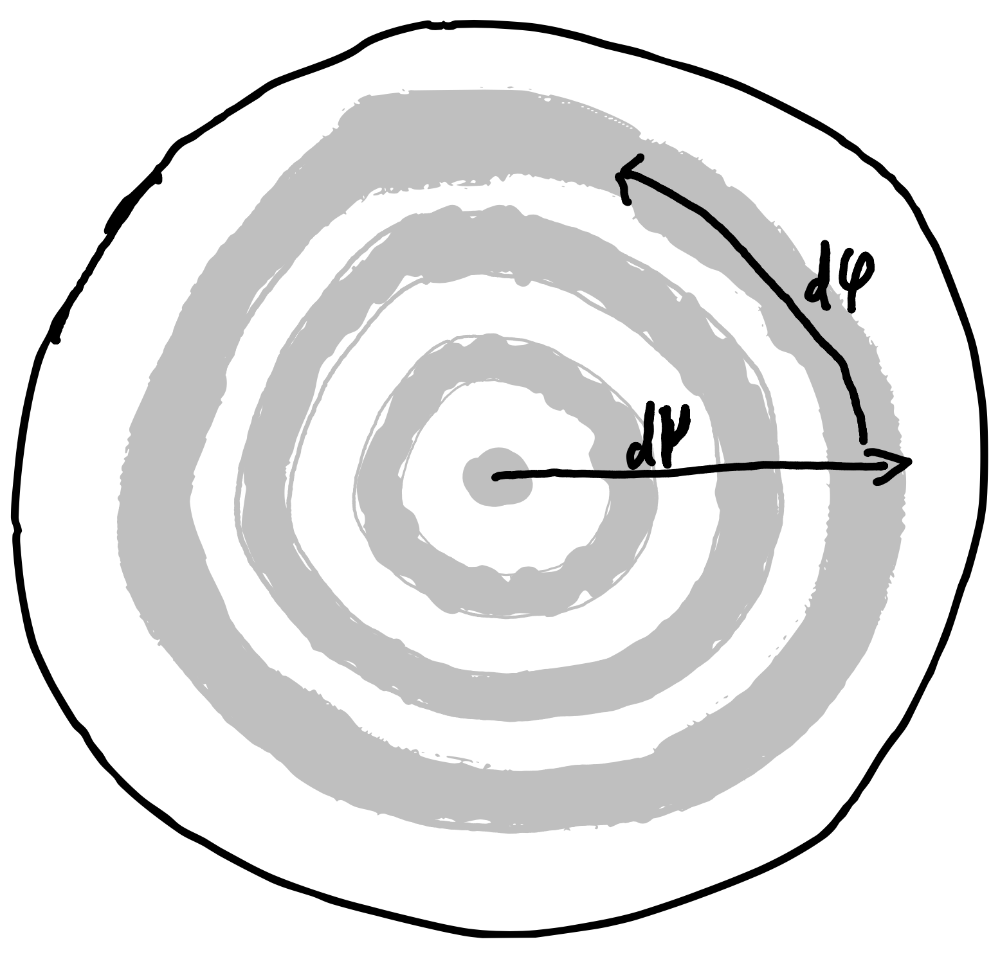

The Phasecurve
--------------

Geometry
^^^^^^^^

Calculating a phasecurve from a GCM output is a two step process:

1. Calculating the angle dependend intensity field at the top of the atmosphere (TOA)
2. Integrating the intensityfield

Step 1 should be performed on a grid of longitude and latitude in order to get the global planetary radiation field.
Step 2 then depends on the planetary phase. The observer will phase different sides of the planet during its orbit if we assume the planet to be tidally locked.

The flux :math:`F_\lambda` at wavelength :math:`\lambda` in the direction of an observer can be obtained from integrating the planetary radiation field :math:`I_{\theta, \phi}(\mu)`

.. math::
   F_\lambda = \int_0^{2\pi}\int_{0}^{1} I_{\phi,\theta}(\mu) \mu \,\mathrm{d}\mu \,\mathrm{d}\varphi

where :math:`\mu` is the cosine of the angle between the the atmospheric normal and the direction of the observer and :math:`\phi` and :math:`\theta` are the longitude and latitude respectively.

   Geometry of the disk integrated spectrum from the perspective of the observer. :math:`\mu` and :math:`\varphi` are the coordinates of the integration.

The integral is then carried out as an integration of the intensity field along all contributing annuli of constant :math:`\mu` (see Figure above). The observer rotates around the sphere in order to catch the phase dependence. This is numerically realised by a rotation of the intensityfield around the sphere.

Realisation
^^^^^^^^^^^

First step is to create a longitude-latitude grid of angle depended (currently containing 20 :math:`\mu` gaussian quadrature points) TOA intensities.
``prt_phasecurve`` uses a list of temperature (assuming pressure as the vertical coordinate), abundancies to calculate the TOA intensity.
Ideally suited would be a grid of :math:`15^\circ` resolution in longitude and latitude.
Calculating the phase specific emission spectrum (e.g., the dayside emission spectrum) is then done by performing the above integral over the intensityfield.
We discretize the integral by integrating over the interpolated intensityfield (using radial basis function interpolation).
